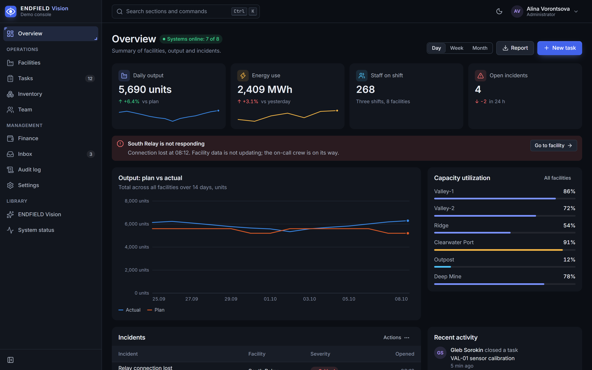
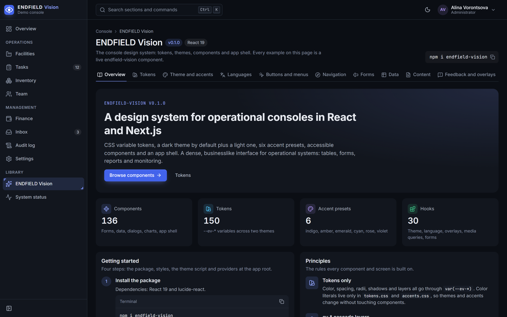
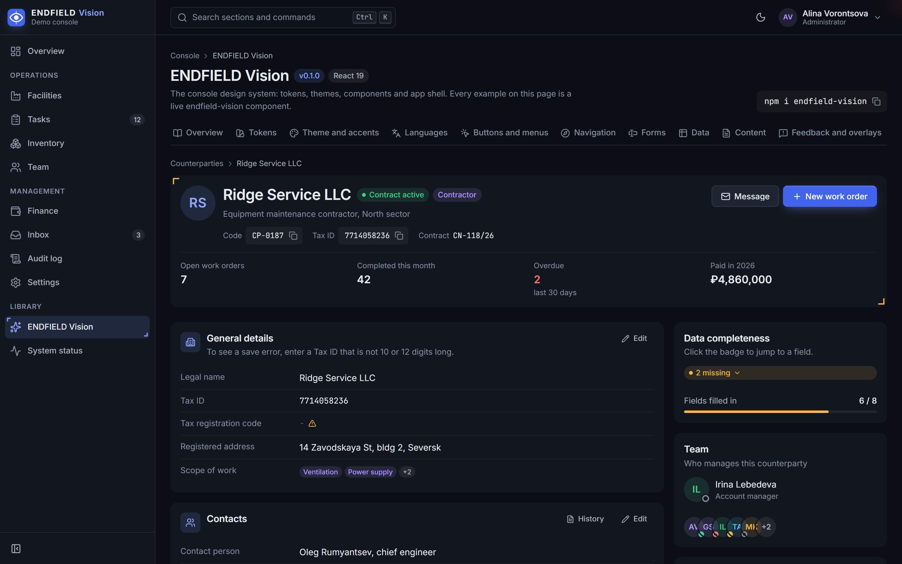
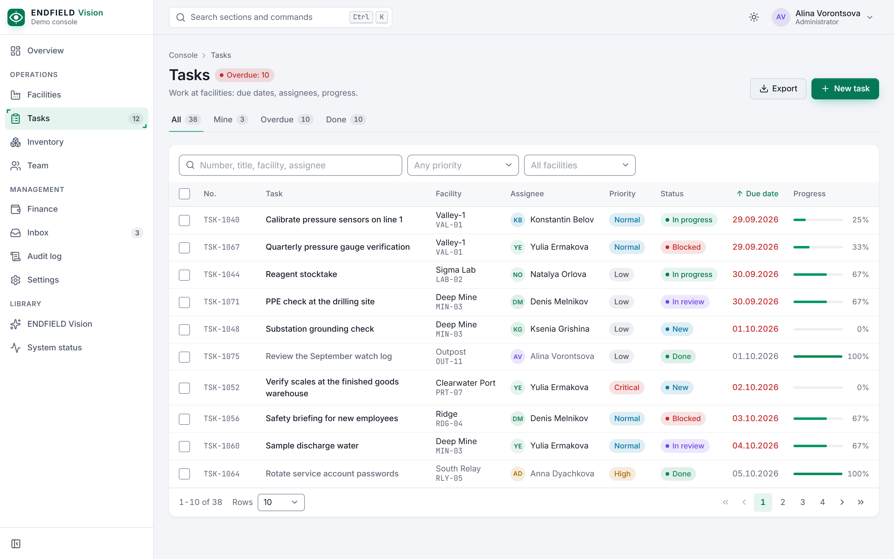
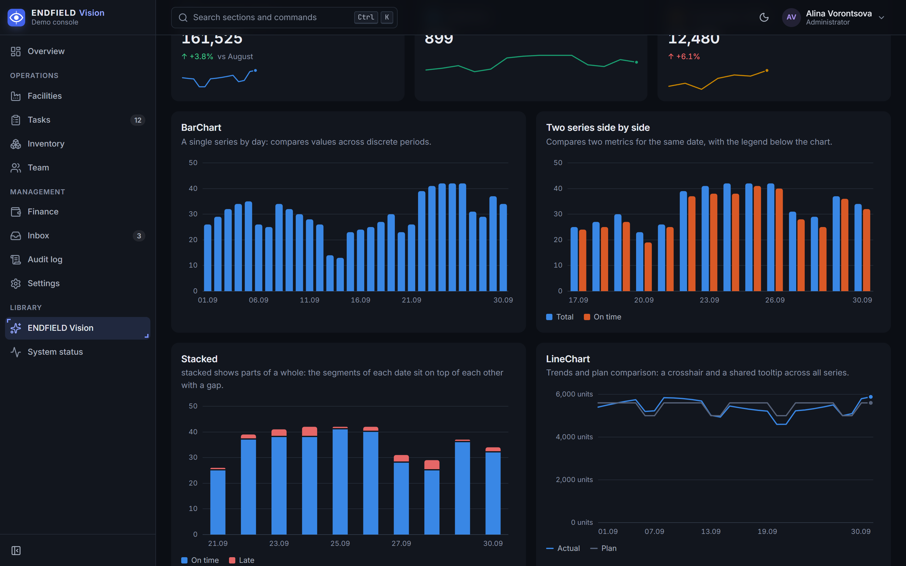

<div align="center">


# ENDFIELD Vision

**A design system for dense work consoles on React 19 and Next.js**

Tokens, dark and light themes, accent presets and accessible components with no third-party UI kit underneath.

[](https://github.com/RetentionSoftware/endfield-vision/actions/workflows/ci.yml)
[](packages/vision/package.json)
[](LICENSE)
[](https://github.com/RetentionSoftware/endfield-vision/commits/main)
[](https://github.com/RetentionSoftware/endfield-vision/stargazers)

[](#whats-inside)
[](#whats-inside)
[](packages/vision/README.md#tokens)
[](packages/vision/src/__tests__)
[](packages/vision/README.md#language)

[](https://react.dev)
[](https://nextjs.org)
[](https://www.typescriptlang.org)

**English** | [Русский](README.ru.md)

</div>

<p align="center">
  
</p>

## Why

Endfield Vision is built for the screens people stare at all day: admin panels, CRMs, dispatch and monitoring consoles. Compact controls, tables that hold up with real data, charts that read at a glance, and a dark theme that is the default rather than an afterthought.

- **Tokens all the way down.** Colors, spacing, radii, shadows and z-layers are CSS variables (`--ev-*`). Swap the theme or accent without touching a single component.
- **Two themes, six accents.** Dark (default), light and "follow the system"; accent presets `indigo`, `amber`, `emerald`, `cyan`, `rose`, `violet`, or your own in five lines of CSS. `ThemeScript` applies them before the first paint, so there is no flash.
- **Accessible by default.** WAI-ARIA keyboard patterns for menus, lists, trees, tabs and grids; focus management in overlays; layered Escape handling; contrast-checked text tokens; hidden data tables for chart readers; `prefers-reduced-motion` respected everywhere.
- **English and Russian built in.** Every label, aria-label, placeholder and empty state comes from a typed dictionary. Override any string, or use a dictionary as the base for a third language.
- **Plays well with others.** Styles live in cascade layers (`@layer ev.*`) and use the `ev-` prefix, so your own CSS and Tailwind always win without specificity fights.
- **Server Components friendly.** `'use client'` is set per file; utilities such as dates, masks and `cx` are importable on the server.
- **One runtime dependency.** Just `lucide-react` for icons. Charts, date pickers, masks, the command palette and drag and drop are all in-house.
- **Yours to change.** The package ships its source next to `dist/`: copy a component into your project and own it.

## Screenshots

<table>
  <tr>
    <td width="50%"><br><sub><b>Showcase.</b> Every library element with live examples.</sub></td>
    <td width="50%"><br><sub><b>CRM building blocks.</b> Record header, editable sections, completeness.</sub></td>
  </tr>
  <tr>
    <td width="50%"><br><sub><b>Light theme, emerald accent.</b> DataTable with filters and pagination.</sub></td>
    <td width="50%"><br><sub><b>Charts.</b> No chart library, tooltips and keyboard included.</sub></td>
  </tr>
</table>

## Installation

```bash
npm install endfield-vision
```

<details>
<summary>pnpm, yarn, bun</summary>

```bash
pnpm add endfield-vision
yarn add endfield-vision
bun add endfield-vision
```

</details>

Requires `react` and `react-dom` 19. Next.js is optional: the library works in any React app (Vite and others).

## Quick start (Next.js App Router)

**1. Styles and the theme script** in the root layout:

```tsx
// app/layout.tsx
import 'endfield-vision/styles.css'
import { ThemeScript } from 'endfield-vision'
import { Providers } from './providers'

export default function RootLayout({ children }: { children: React.ReactNode }) {
  return (
    <html lang="en" data-theme="dark" suppressHydrationWarning>
      <head>
        <ThemeScript /> {/* theme and accent before the first paint */}
      </head>
      <body>
        <Providers>{children}</Providers>
      </body>
    </html>
  )
}
```

**2. Providers** for language, links, dialogs and toasts:

```tsx
// app/providers.tsx
'use client'
import { LinkProvider, LocaleProvider, ModalsProvider, Toaster, type LinkComponent } from 'endfield-vision'
import NextLink from 'next/link'

const AppLink: LinkComponent = ({ href, ...rest }) => <NextLink href={href} {...rest} />

export function Providers({ children }: { children: React.ReactNode }) {
  return (
    <LocaleProvider locale="en">
      <LinkProvider component={AppLink}>
        <ModalsProvider>
          {children}
          <Toaster />
        </ModalsProvider>
      </LinkProvider>
    </LocaleProvider>
  )
}
```

**3. Build a screen:**

```tsx
'use client'
import { Button, Card, DataTable, StatusPill, toast, type Column } from 'endfield-vision'

type Task = { id: string; title: string; done: boolean }

const columns: Column<Task>[] = [
  { key: 'title', header: 'Task', cell: (t) => t.title, primary: true },
  { key: 'status', header: 'Status', cell: (t) => <StatusPill tone={t.done ? 'success' : 'info'}>{t.done ? 'Done' : 'In progress'}</StatusPill> },
]

export function Tasks({ tasks }: { tasks: Task[] }) {
  return (
    <Card title="Tasks" flush actions={<Button variant="primary" onClick={() => toast.success('Task created')}>New task</Button>}>
      <DataTable columns={columns} rows={tasks} rowKey={(t) => t.id} empty="No tasks yet" />
    </Card>
  )
}
```

Full setup (fonts, accents, motion, layers, tokens and the component reference) is in the [package README](packages/vision/README.md).

## What's inside

| Group | Components |
|---|---|
| Actions | `Button`, `LinkButton`, `IconButton`, `Menu`, `ContextMenu`, `Popover`, `CopyButton` |
| Forms | `Field`, `Input`, `Textarea`, `NumberInput`, `MoneyInput`, `PhoneInput` (22 countries), `TimeInput`, `DateField`, `DateRangePicker`, `Calendar`, `ColorField`, `Slider`, `TagInput`, `OtpInput`, `InlineEdit` |
| Choice | `Select`, `MultiSelect`, `Checkbox`, `Switch`, `RadioGroup`, `SegmentedControl`, `Chip`, `ChipGroup` |
| Data | `DataTable`, `Pagination`, `FilterBar`, `KeyValueList`, `StatTile`, `Badge`, `StatusPill`, `Avatar`, `Progress`, `Timeline`, `UptimeBar`, `TreeView` |
| Charts | `BarChart`, `LineChart`, `AreaChart`, `Sparkline`, `DonutChart`, `Heatmap`, `HeatmapMatrix`, `RingProgress`, `Gauge` |
| Feedback and overlays | `Modal`, `useModals`, `Drawer`, `toast`, `Callout`, `Banner`, `EmptyState`, `ErrorState`, `Skeleton`, `Spinner`, `Tooltip`, `Lightbox`, `ScreenOverlay` |
| Navigation and layout | `AppShell`, `Sidebar`, `Topbar`, `PageHeader`, `Breadcrumbs`, `Tabs`, `Steps`, `Accordion`, `CommandPalette`, `StatusBar`, `WorkspaceSwitcher` |
| Content | `CodeBlock`, `InlineCode`, `Highlight`, `RelativeTime`, `ExpandableText`, `AnimatedNumber` |
| CRM | `RecordHeader`, `RecordLayout`, `EditablePanel`, `CompletenessBadge`, `KanbanBoard`, `SlaTimer`, `PermissionMatrix`, `SettingsList`, `SaveBar`, `NotificationCenter`, `ChatThread`, `Composer` |

Plus hooks for theme, language, overlays, media queries, URL-synced filters, entrance motion and form state. The badge counts are generated from the package exports by `npm run stats`.

## Repository

| Path | What it is |
|---|---|
| [`packages/vision`](packages/vision) | The `endfield-vision` library: styles, components, theme, i18n. |
| [`apps/playground`](apps/playground) | Next.js 16 demo console (overview, facilities, tasks, inventory, team, finance, inbox, audit log, settings) and the **ENDFIELD Vision** showcase at `/vision`. |

## Development

```bash
git clone https://github.com/RetentionSoftware/endfield-vision.git
cd endfield-vision
npm install
npm run dev
```

The playground runs at http://localhost:3200 and uses the library straight from source, so edits in `packages/vision/src` show up immediately.

| Command | What it does |
|---|---|
| `npm run typecheck` | TypeScript across all workspaces |
| `npm run lint` | ESLint, including project rules (no native `<select>`, no `title=`, no em dashes in strings) |
| `npm test` | Vitest, server-side render tests |
| `npm run build` | Library `dist/` and a production build of the playground |
| `npm run check:dist -w endfield-vision` | Imports the built package the way a consumer would |
| `npm run stats` | Recounts components, hooks, tokens and tests for the badges |

Node 22 or newer (see `.nvmrc`). Conventions for contributors and AI agents are in [AGENTS.md](AGENTS.md).

## License

[MIT](LICENSE) © RetentionSoftware
