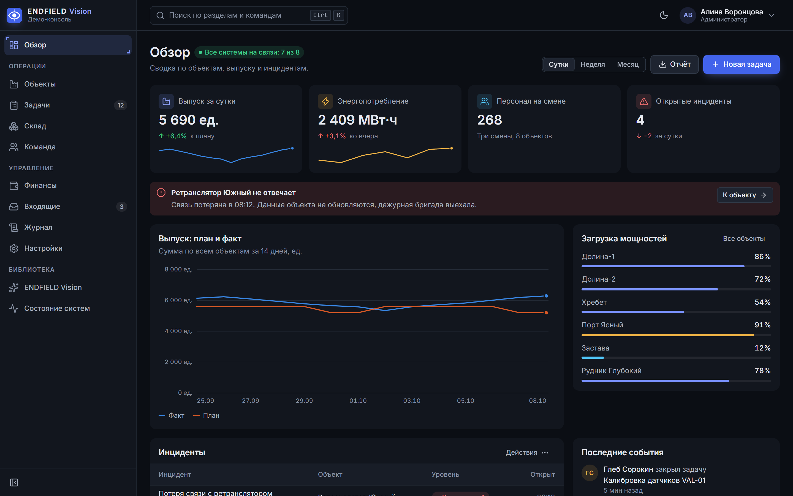
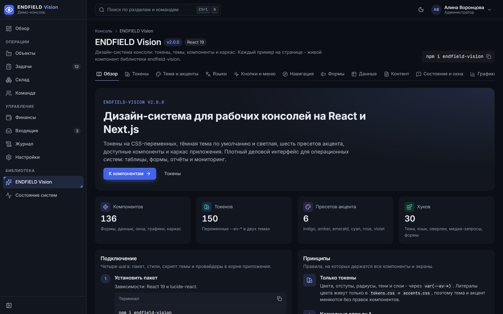
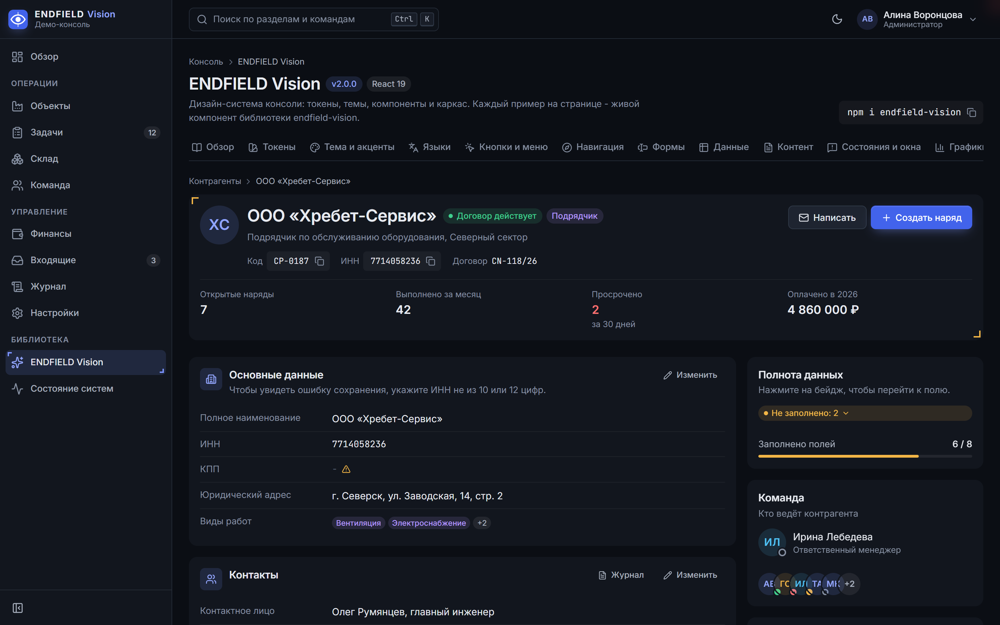
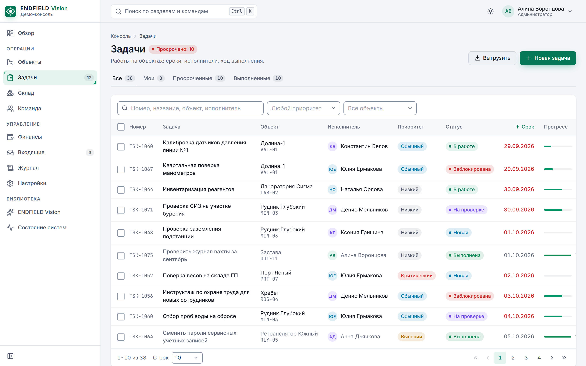
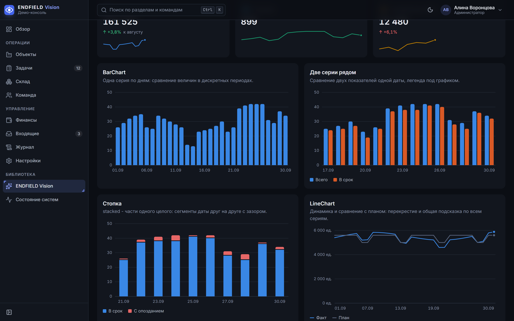

<div align="center">


# ENDFIELD Vision

**Дизайн-система для плотных рабочих консолей на React 19 и Next.js**

Токены, тёмная и светлая темы, пресеты акцента и доступные компоненты без сторонних UI-библиотек.

[](https://github.com/RetentionSoftware/endfield-vision/actions/workflows/ci.yml)
[](packages/vision/package.json)
[](LICENSE)
[](https://github.com/RetentionSoftware/endfield-vision/commits/main)
[](https://github.com/RetentionSoftware/endfield-vision/stargazers)

[](#что-внутри)
[](#что-внутри)
[](packages/vision/README.ru.md#токены-главное)
[](packages/vision/src/__tests__)
[](packages/vision/README.ru.md#язык)

[](https://react.dev)
[](https://nextjs.org)
[](https://www.typescriptlang.org)

[English](README.md) | **Русский**

</div>

<p align="center">
  
</p>

## Зачем

Endfield Vision - для экранов, за которыми работают весь день: админки, CRM, диспетчерские и консоли мониторинга. Компактные контролы, таблицы, которые выдерживают реальные данные, графики, которые читаются с одного взгляда, и тёмная тема по умолчанию, а не «на потом».

- **Всё на токенах.** Цвета, отступы, радиусы, тени и слои - CSS-переменные `--ev-*`. Тема и акцент меняются без правок компонентов.
- **Две темы, шесть акцентов.** Тёмная (по умолчанию), светлая и «как в системе»; пресеты `indigo`, `amber`, `emerald`, `cyan`, `rose`, `violet` или свой акцент в пять строк CSS. `ThemeScript` ставит их до первой отрисовки - без вспышки.
- **Доступность по умолчанию.** Клавиатура по паттернам WAI-ARIA в меню, списках, деревьях, вкладках и таблицах; управление фокусом в окнах; Escape закрывает верхний слой; контраст текстовых токенов проверен; у графиков скрытая таблица для скринридера; `prefers-reduced-motion` учтён везде.
- **Английский и русский из коробки.** Подписи, aria-label, плейсхолдеры и пустые состояния - из типизированного словаря. Любую строку можно переопределить, а словарь взять за основу третьего языка.
- **Уживается с вашим кодом.** Стили лежат в каскадных слоях (`@layer ev.*`) и с префиксом `ev-`: ваш CSS и Tailwind всегда сильнее, специфичность бороться не нужно.
- **Дружит с серверными компонентами.** `'use client'` стоит пофайлово; утилиты (даты, маски, `cx`) импортируются и на сервере.
- **Одна зависимость.** Только `lucide-react` для иконок. Графики, календари, маски, палитра команд и перетаскивание - свои.
- **Можно доработать под себя.** Пакет публикует исходники рядом с `dist/`: скопируйте компонент в проект и правьте как свой.

## Скриншоты

<table>
  <tr>
    <td width="50%"><br><sub><b>Витрина.</b> Все элементы библиотеки с живыми примерами.</sub></td>
    <td width="50%"><br><sub><b>Заготовки для CRM.</b> Шапка записи, секции с правкой, полнота данных.</sub></td>
  </tr>
  <tr>
    <td width="50%"><br><sub><b>Светлая тема, акцент emerald.</b> DataTable с фильтрами и пагинацией.</sub></td>
    <td width="50%"><br><sub><b>Графики.</b> Без сторонних библиотек, с подсказками и клавиатурой.</sub></td>
  </tr>
</table>

## Установка

```bash
npm install endfield-vision
```

<details>
<summary>pnpm, yarn, bun</summary>

```bash
pnpm add endfield-vision
yarn add endfield-vision
bun add endfield-vision
```

</details>

Нужны `react` и `react-dom` 19. Next.js не обязателен: библиотека работает в любом React-приложении (Vite и т. п.).

## Быстрый старт (Next.js App Router)

**1. Стили и скрипт темы** в корневом макете:

```tsx
// app/layout.tsx
import 'endfield-vision/styles.css'
import { ThemeScript } from 'endfield-vision'
import { Providers } from './providers'

export default function RootLayout({ children }: { children: React.ReactNode }) {
  return (
    <html lang="ru" data-theme="dark" suppressHydrationWarning>
      <head>
        <ThemeScript /> {/* тема и акцент до первой отрисовки */}
      </head>
      <body>
        <Providers>{children}</Providers>
      </body>
    </html>
  )
}
```

**2. Провайдеры** языка, ссылок, окон и уведомлений:

```tsx
// app/providers.tsx
'use client'
import { LinkProvider, LocaleProvider, ModalsProvider, Toaster, type LinkComponent } from 'endfield-vision'
import NextLink from 'next/link'

const AppLink: LinkComponent = ({ href, ...rest }) => <NextLink href={href} {...rest} />

export function Providers({ children }: { children: React.ReactNode }) {
  return (
    <LocaleProvider locale="ru">
      <LinkProvider component={AppLink}>
        <ModalsProvider>
          {children}
          <Toaster />
        </ModalsProvider>
      </LinkProvider>
    </LocaleProvider>
  )
}
```

**3. Экран:**

```tsx
'use client'
import { Button, Card, DataTable, StatusPill, toast, type Column } from 'endfield-vision'

type Task = { id: string; title: string; done: boolean }

const columns: Column<Task>[] = [
  { key: 'title', header: 'Задача', cell: (t) => t.title, primary: true },
  { key: 'status', header: 'Статус', cell: (t) => <StatusPill tone={t.done ? 'success' : 'info'}>{t.done ? 'Готово' : 'В работе'}</StatusPill> },
]

export function Tasks({ tasks }: { tasks: Task[] }) {
  return (
    <Card title="Задачи" flush actions={<Button variant="primary" onClick={() => toast.success('Задача создана')}>Новая задача</Button>}>
      <DataTable columns={columns} rows={tasks} rowKey={(t) => t.id} empty="Задач пока нет" />
    </Card>
  )
}
```

Полная настройка (шрифты, акценты, анимация, слои, токены и справочник компонентов) - в [README пакета](packages/vision/README.ru.md).

## Что внутри

| Группа | Компоненты |
|---|---|
| Действия | `Button`, `LinkButton`, `IconButton`, `Menu`, `ContextMenu`, `Popover`, `CopyButton` |
| Формы | `Field`, `Input`, `Textarea`, `NumberInput`, `MoneyInput`, `PhoneInput` (22 страны), `TimeInput`, `DateField`, `DateRangePicker`, `Calendar`, `ColorField`, `Slider`, `TagInput`, `OtpInput`, `InlineEdit` |
| Выбор | `Select`, `MultiSelect`, `Checkbox`, `Switch`, `RadioGroup`, `SegmentedControl`, `Chip`, `ChipGroup` |
| Данные | `DataTable`, `Pagination`, `FilterBar`, `KeyValueList`, `StatTile`, `Badge`, `StatusPill`, `Avatar`, `Progress`, `Timeline`, `UptimeBar`, `TreeView` |
| Графики | `BarChart`, `LineChart`, `AreaChart`, `Sparkline`, `DonutChart`, `Heatmap`, `HeatmapMatrix`, `RingProgress`, `Gauge` |
| Состояния и окна | `Modal`, `useModals`, `Drawer`, `toast`, `Callout`, `Banner`, `EmptyState`, `ErrorState`, `Skeleton`, `Spinner`, `Tooltip`, `Lightbox`, `ScreenOverlay` |
| Навигация и каркас | `AppShell`, `Sidebar`, `Topbar`, `PageHeader`, `Breadcrumbs`, `Tabs`, `Steps`, `Accordion`, `CommandPalette`, `StatusBar`, `WorkspaceSwitcher` |
| Контент | `CodeBlock`, `InlineCode`, `Highlight`, `RelativeTime`, `ExpandableText`, `AnimatedNumber` |
| CRM | `RecordHeader`, `RecordLayout`, `EditablePanel`, `CompletenessBadge`, `KanbanBoard`, `SlaTimer`, `PermissionMatrix`, `SettingsList`, `SaveBar`, `NotificationCenter`, `ChatThread`, `Composer` |

И хуки: тема, язык, оверлеи, медиа-запросы, фильтры в адресе, анимация появления, состояние форм. Числа на бейджах считаются по экспортам пакета командой `npm run stats`.

## Репозиторий

| Путь | Что это |
|---|---|
| [`packages/vision`](packages/vision) | Библиотека `endfield-vision`: стили, компоненты, тема, словари. |
| [`apps/playground`](apps/playground) | Next.js 16: демо-консоль (обзор, объекты, задачи, склад, команда, финансы, входящие, журнал, настройки) и витрина **ENDFIELD Vision** на `/vision`. |

## Разработка

```bash
git clone https://github.com/RetentionSoftware/endfield-vision.git
cd endfield-vision
npm install
npm run dev
```

Плейграунд откроется на http://localhost:3200 и берёт библиотеку из исходников: правки в `packages/vision/src` видны сразу.

| Команда | Что делает |
|---|---|
| `npm run typecheck` | TypeScript во всех пакетах |
| `npm run lint` | ESLint с правилами проекта (без нативного `<select>`, без `title=`, без длинного тире в строках) |
| `npm test` | Vitest, тесты серверного рендера |
| `npm run build` | `dist/` библиотеки и production-сборка плейграунда |
| `npm run check:dist -w endfield-vision` | Импортирует собранный пакет так же, как потребитель |
| `npm run stats` | Пересчитывает компоненты, хуки, токены и тесты для бейджей |

Node 22 и новее (см. `.nvmrc`). Конвенции для разработчиков и ИИ-агентов - в [AGENTS.md](AGENTS.md).

## Лицензия

[MIT](LICENSE) © RetentionSoftware
